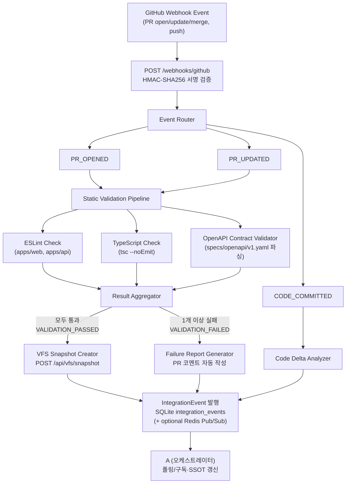

# D. 인테그레이션 & 샌드박스 — 파이프라인 설계

> 담당: D (한승준)
> 관련 문서: [`collaboration-interface.md`](collaboration-interface.md), [`d-integration-scenarios.md`](d-integration-scenarios.md)

**구현·env 변경 시:** [d-owner-workflow-fe-be-handoff.md](d-owner-workflow-fe-be-handoff.md)에 따라 `collaboration-env-and-endpoints.md`·`apps/api/.env.example`·본 문서를 같은 PR에서 갱신하고, FE/BE에는 해당 문서 섹션으로 안내한다.

---

## 1. 전체 파이프라인 아키텍처



---

## 2. 컴포넌트별 책임

### 2-1. Webhook Receiver (`POST /webhooks/github`)

| 항목 | 내용 |
|------|------|
| 위치 | `apps/api/src/integration/webhook.controller.ts` |
| 책임 | GitHub Webhook 수신, HMAC-SHA256 서명 검증(`GITHUB_WEBHOOK_SECRET`), 이벤트 타입 파싱 |
| 처리 이벤트 | `pull_request` (opened/synchronize/closed), `push` |
| 실패 처리 | 서명 불일치 시 `401` 반환, 지원하지 않는 이벤트는 `200` ACK 후 무시 |

**서명 검증 흐름:**
```
1. GitHub이 X-Hub-Signature-256 헤더에 HMAC-SHA256(body, GITHUB_WEBHOOK_SECRET) 전송
2. 서버에서 동일 계산 후 비교 (타이밍 공격 방지: crypto.timingSafeEqual 사용)
3. 일치하면 Event Router로 전달, 불일치하면 즉시 401
```

---

### 2-2. Event Router

| 항목 | 내용 |
|------|------|
| 위치 | `apps/api/src/integration/event-router.service.ts` |
| 책임 | GitHub 이벤트 액션을 내부 `IntegrationEventType`으로 변환 후 적절한 핸들러 호출 |

**매핑 테이블:**

| GitHub 이벤트 | GitHub 액션 | 내부 이벤트 타입 |
|---------------|-------------|-----------------|
| `pull_request` | `opened` | `PR_OPENED` |
| `pull_request` | `synchronize` | `PR_UPDATED` |
| `pull_request` | `closed` + merged | `PR_MERGED` |
| `push` | — | `CODE_COMMITTED` |

---

### 2-3. Static Validation Pipeline

| 항목 | 내용 |
|------|------|
| 위치 | `apps/api/src/integration/validation.service.ts` + GitHub Actions CI |
| 책임 | ESLint, TypeScript, OpenAPI 계약 검증을 병렬 실행 후 결과 집계 |
| 트리거 | `PR_OPENED`, `PR_UPDATED` |

**세부 검증 항목:**

#### ESLint Check
- 대상: `apps/web/**/*.{ts,tsx}`, `apps/api/**/*.ts`
- 설정: 루트 `.eslintrc.js` (D 관리)
- 실패 기준: `error` 레벨 이상 1건 이상

#### TypeScript Check
- 명령어: `tsc --noEmit -p apps/web/tsconfig.json && tsc --noEmit -p apps/api/tsconfig.json`
- 실패 기준: 컴파일 에러 1건 이상

#### OpenAPI Contract Validator
- 도구: `scripts/validate-api-contract.js`
- 검증 항목:
  1. `specs/openapi/v1.yaml` 파일 파싱 가능 여부
  2. 명시된 엔드포인트가 `specs/api-contract.md`와 일치하는지
  3. PR에서 `specs/openapi/` 파일이 변경된 경우 `CONTRACT_CHANGED` 이벤트 추가 발행
- 실패 기준: 파싱 오류 또는 엔드포인트 불일치

---

### 2-4. Result Aggregator

| 항목 | 내용 |
|------|------|
| 위치 | `apps/api/src/integration/validation.service.ts` 내 집계 로직 |
| 책임 | 세 검증 결과를 `ValidationResult` 타입으로 통합, 최종 pass/fail 판정 |

```typescript
// 판정 규칙
const passed = lint.passed && typecheck.passed && contract.passed;
const eventType = passed ? 'VALIDATION_PASSED' : 'VALIDATION_FAILED';
```

---

### 2-5. VFS Snapshot Creator (`POST /api/vfs/snapshot`)

| 항목 | 내용 |
|------|------|
| 위치 | `apps/api/src/integration/vfs.service.ts` |
| 책임 | AI 에이전트 산출물(코드 변경)을 VFS(DB 기반 가상 파일 시스템)에 저장, 원본 파일 무변경 보장 |
| 트리거 | 검증 통과 후, 또는 AI 에이전트가 코드 생성 산출물 제출 시 |

**VFS 동작 방식:**
```
1. AI 에이전트가 코드 변경을 제안
2. POST /api/vfs/snapshot → DB에 파일 트리 스냅샷 저장 (snapshotId 발급)
3. GET /api/vfs/diff/:snapshotId → C(프론트)가 Diff UI 렌더링
4. 학습자가 승인: POST /api/vfs/approve/:snapshotId
5. 실제 Git 브랜치에 변경 반영 (Shadow Branch → 실제 브랜치 PR 생성)
```

**핵심 원칙**: AI는 학습자 메인 작업공간에 직접 쓰지 않습니다. 반드시 VFS를 거쳐 학습자 승인 후에만 반영됩니다.

---

### 2-6. Failure Report Generator

| 항목 | 내용 |
|------|------|
| 위치 | `apps/api/src/integration/report.service.ts` |
| 책임 | 검증 실패 시 구체적인 에러 목록을 GitHub PR 코멘트로 자동 작성 |
| 사용 API | `GITHUB_TOKEN`으로 `POST /repos/{owner}/{repo}/issues/{issue_number}/comments` |

**PR 코멘트 형식:**
```markdown
## 정적 검증 실패 리포트

| 검증 항목 | 결과 |
|-----------|------|
| ESLint    | ❌ 3개 오류 |
| TypeScript | ✅ 통과 |
| OpenAPI 계약 | ❌ 2개 불일치 |

### ESLint 오류
- `apps/api/src/auth/auth.service.ts:42` — no-unused-vars
- ...

### OpenAPI 계약 불일치
- `POST /auth/login` — 응답 필드 `token` 누락
- ...

> 수정 후 커밋을 추가하면 자동으로 재검증됩니다.
```

---

### 2-7. Code Delta Analyzer

| 항목 | 내용 |
|------|------|
| 위치 | `scripts/code-delta-analyzer.js` |
| 책임 | git diff 기반으로 변경된 엔드포인트/DTO/에러 정책을 분석해 `CodeDeltaSummary` 생성 |
| 트리거 | GitHub `push` 웹훅에서 `CODE_DELTA_BASE_SHA`/`CODE_DELTA_HEAD_SHA`로 실행; CI에서도 동일 스크립트 실행 가능 |
| 출력 | `CODE_DELTA_ANALYZED` 이벤트로 발행 → A가 SSOT `codeDeltaSummary` 필드 갱신 |

---

## 3. 이벤트 발행 흐름 (SQLite 1차, Redis 선택)

**1차 저장소:** Nest `EventPublisherSqlite` → 워크스페이스 SQLite `integration_events` 테이블. 조회: `GET /api/integration/events` (Bearer).

**선택 — Redis Pub/Sub:** `REDIS_URL`이 있고 `INTEGRATION_REDIS_PUBLISHER=1`이면 동일 페이로드를 채널 `INTEGRATION_REDIS_CHANNEL`(기본 `integration:events`)로도 발행한다. JWT 폐기와 같은 Redis 인스턴스를 쓸 수 있으나 **키/채널이 분리**된다. A는 폴링 또는 이 채널 구독 중 팀이 합의한 방식을 쓴다.

**발행 시점(요약):**
  - `VALIDATION_PASSED` / `VALIDATION_FAILED` / `VALIDATION_LOOP_DETECTED`
  - `CODE_DELTA_ANALYZED` (push 시 `scripts/code-delta-analyzer.js` 결과)
  - `CONTRACT_CHANGED`, `VFS_*`, PR 이벤트 등 [collaboration-interface.md](collaboration-interface.md) 표준 타입

---

## 4. 실패 처리 정책

| 실패 케이스 | 처리 방식 |
|-------------|-----------|
| Webhook 서명 불일치 | 401 반환, 로그 기록, 알림 없음 |
| `GITHUB_WEBHOOK_REQUIRE_SIGNATURE=1` 인데 시크릿 비어 있음 | 401(또는 설정 오류) — 운영에서 서명 없이 열리지 않음 |
| 정적 검증 실패 | PR merge 블록 + PR 코멘트 + `VALIDATION_FAILED` 이벤트 발행 |
| GitHub API 호출 실패 | 최대 3회 재시도 (지수 백오프), 실패 시 에러 로그만 기록 |
| Redis Pub/Sub 발행 실패 | **P-1:** 동일 프로세스 내 지수 백오프 재시도(`INTEGRATION_REDIS_PUBLISH_MAX_ATTEMPTS`, 기본 3) 후 실패 시 로그. (BullMQ 등 외부 큐는 V2) |
| VFS 스냅샷 저장 실패 | `500` 반환 + 에러 로그, AI 에이전트에게 재시도 안내 |

---

## 5. 루프 가드 (plan.md 요구사항 반영)

- 동일 PR에 대해 검증 재시도 최대 **5회** (5회 초과 시 `VALIDATION_LOOP_DETECTED` 이벤트 발행 후 중단)
- VFS 승인 없이 자동으로 실제 브랜치에 쓰는 동작 **금지**
- Webhook 정적 검증: `WEBHOOK_VALIDATION_MAX_MS`(기본 28000ms) 상한으로 동기 레이스.
- **P-2 (인메모리 큐):** `WEBHOOK_VALIDATION_ASYNC=1`이면 PR 이벤트 발행 직후 HTTP는 빨리 200을 주고, 정적 검증은 **Nest 프로세스 내 순차 큐**에서 실행한다. 동기 모드에서 **타임아웃**이 나면 같은 큐로 넘겨 재시도한다(중복 실행 가능성은 문서화된 제한).

---

## 6. MVP / V2 경계

| 기능 | MVP | V2 |
|------|-----|----|
| GitHub Webhook 수신 + 서명 검증 | ✅ | — |
| ESLint / TypeScript 정적 검증 | ✅ | — |
| OpenAPI 계약 검증 (정적) | ✅ | — |
| VFS 스냅샷 저장 + 학습자 승인 | ✅ | — |
| PR 코멘트 자동 생성 | ✅ | — |
| SQLite 통합 이벤트 스트림 | ✅ | — |
| Redis Pub/Sub 중복 발행 | 선택 (`INTEGRATION_REDIS_PUBLISHER`) | — |
| 동적 E2E 검증 (Playwright) | — | ✅ |
| 완전 자동 로컬 IDE 동기화 | — | ✅ |
| 실 Git 자동 머지/푸시 | — | ✅ |
