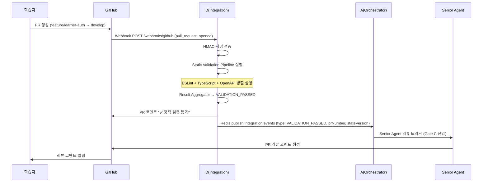
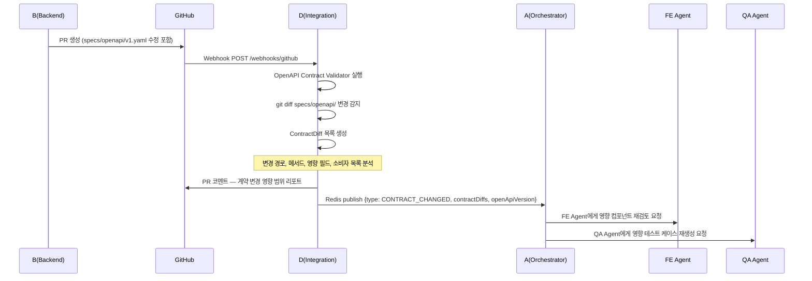
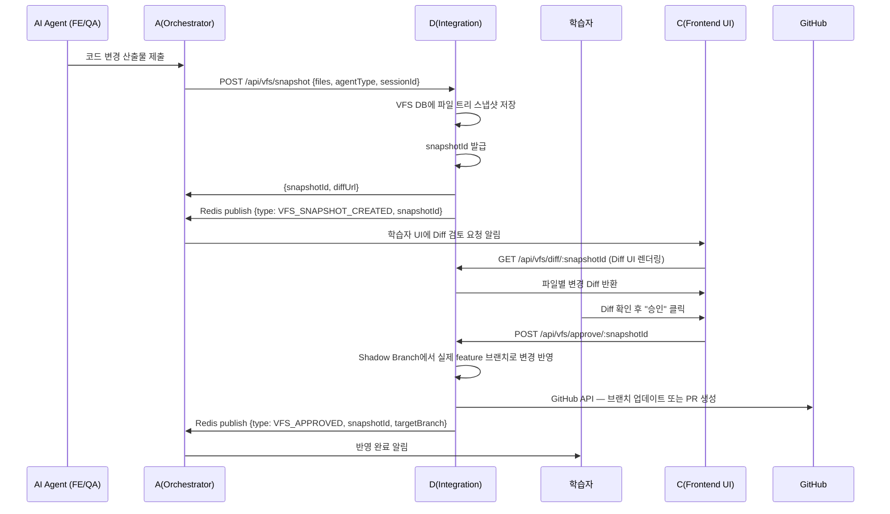
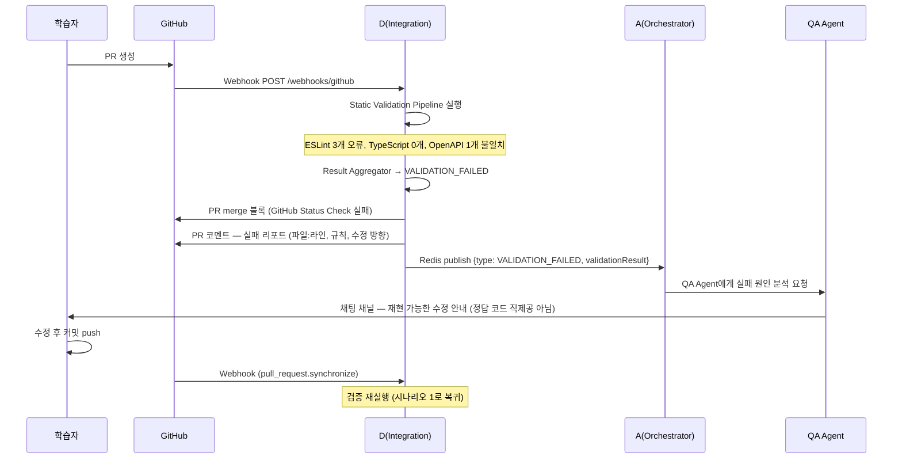

# D. 인테그레이션 & 샌드박스 — 시나리오 정의

> 담당: D (한승준)
> 관련 문서: [`d-integration-pipeline.md`](d-integration-pipeline.md), [`collaboration-interface.md`](collaboration-interface.md)

---

## 시나리오 개요

| # | 시나리오 | 트리거 | 핵심 결과 |
|---|---------|--------|-----------|
| 1 | PR 제출 → 정적 검증 → Senior 리뷰 트리거 | 학습자 PR 생성 | 검증 통과 시 Gate C 진입 |
| 2 | OpenAPI 계약 변경 감지 → 영향 범위 리포트 | B가 openapi 파일 수정 후 PR | 계약 변경 영향 범위 팀 공유 |
| 3 | VFS Shadow Branch → 학습자 승인 → 반영 | AI 에이전트가 코드 생성 제안 | 학습자 승인 후에만 실제 브랜치 반영 |
| 4 | 검증 실패 → 실패 리포트 → 재작업 요청 | PR에서 정적 검증 실패 | 학습자에게 구체적 수정 안내 |

---

## 시나리오 1: PR 제출 → 정적 검증 → Senior 리뷰 트리거

### 전제 조건
- 학습자가 `feature/learner-*` 브랜치에서 `develop`으로 PR 생성
- `specs/openapi/v1.yaml` 최신 상태로 유지됨

### 흐름



### Input

| 항목 | 값 |
|------|----|
| GitHub 이벤트 | `pull_request.opened` 또는 `pull_request.synchronize` |
| PR 브랜치 | `feature/learner-*` |
| 대상 브랜치 | `develop` |

### Output

| 항목 | 결과 |
|------|------|
| PR 상태 | merge 가능 상태 유지 |
| PR 코멘트 | 검증 통과 요약 |
| Redis 이벤트 | `VALIDATION_PASSED` |
| Gate 상태 | A가 Gate C(리뷰) 진입 가능으로 업데이트 |

### 담당 에이전트 / 팀원

| 역할 | 담당 | 행동 |
|------|------|------|
| D | 한승준 | Webhook 수신, 검증 실행, 이벤트 발행 |
| A | 김성원 | `VALIDATION_PASSED` 수신 후 Senior Agent 트리거 |
| Senior Agent | AI | PR 리뷰 코멘트 생성 |

---

## 시나리오 2: OpenAPI 계약 변경 감지 → 영향 범위 리포트

### 전제 조건
- B(박준용)가 새 엔드포인트 추가 또는 기존 응답 구조 변경 후 PR 생성
- PR에 `[contract-changed]` 라벨 포함 (B 담당)

### 흐름



### Input

| 항목 | 값 |
|------|----|
| 변경 파일 | `specs/openapi/v1.yaml` |
| 변경 유형 | 엔드포인트 추가/수정/삭제, 응답 필드 변경 |

### Output

| 항목 | 결과 |
|------|------|
| PR 코멘트 | 계약 변경 영향 범위 리포트 (변경 경로 / 영향 FE 컴포넌트 / 영향 QA 테스트) |
| Redis 이벤트 | `CONTRACT_CHANGED` |
| A의 후속 행동 | FE/QA 에이전트에게 재검토 요청 |

### PR 코멘트 형식 예시

```markdown
## OpenAPI 계약 변경 감지

변경된 엔드포인트:
- `POST /auth/login` — 응답에 `refreshToken` 필드 추가 (**modified**)
- `GET /users/me` — 응답에 `role` 필드 추가 (**modified**)

영향 범위:
- FE: `LoginForm` 컴포넌트, `useAuth` 훅 (refreshToken 처리 로직 추가 필요)
- QA: `auth.login.test.ts` (응답 스키마 검증 업데이트 필요)

> A(오케스트레이터)가 FE/QA 에이전트에게 재검토를 요청했습니다.
```

### 담당 에이전트 / 팀원

| 역할 | 담당 | 행동 |
|------|------|------|
| B | 박준용 | OpenAPI 파일 변경, `[contract-changed]` 라벨 추가 |
| D | 한승준 | 변경 감지, ContractDiff 분석, 이벤트 발행 |
| A | 김성원 | `CONTRACT_CHANGED` 수신 후 FE/QA Agent 트리거 |

---

## 시나리오 3: VFS Shadow Branch → 학습자 승인 → 반영

### 전제 조건
- FE 에이전트 또는 QA 에이전트가 코드 변경 산출물 생성
- 학습자가 아직 VFS 승인을 하지 않은 상태

### 흐름



### Input

| 항목 | 값 |
|------|----|
| 요청 주체 | AI 에이전트 (FE/QA) |
| 페이로드 | 변경 파일 목록, 변경 내용, agentType, sessionId |

### Output

| 항목 | 결과 |
|------|------|
| VFS 스냅샷 | DB 저장 완료, snapshotId 발급 |
| Diff UI | C가 렌더링 (`GET /api/vfs/diff/:snapshotId`) |
| 승인 후 | 실제 브랜치 반영 + `VFS_APPROVED` 이벤트 |

### 핵심 원칙 (plan.md 32-4항 반영)
- AI는 학습자 메인 작업공간에 **절대 직접 쓰지 않습니다**
- 학습자의 명시적 승인(`POST /api/vfs/approve`) 없이는 실제 파일 변경 없음
- 승인 전까지 VFS는 읽기 전용으로 제공

### 담당 에이전트 / 팀원

| 역할 | 담당 | 행동 |
|------|------|------|
| AI Agent | FE/QA Agent | 코드 변경 산출물 제출 |
| A | 김성원 | VFS 스냅샷 생성 요청, 학습자에게 검토 알림 |
| D | 한승준 | VFS 저장, Diff 제공, 승인 처리, 브랜치 반영 |
| C | 유소민 | Diff UI 렌더링 (`GET /api/vfs/diff/:snapshotId` 호출) |
| 학습자 | — | Diff 검토 후 승인/거절 |

---

## 시나리오 4: 검증 실패 → 실패 리포트 → 재작업 요청

### 전제 조건
- 학습자가 PR을 생성했으나 ESLint/TypeScript/OpenAPI 중 하나 이상 실패

### 흐름



### Input

| 항목 | 값 |
|------|----|
| GitHub 이벤트 | `pull_request.opened` 또는 `pull_request.synchronize` |
| 검증 결과 | 1개 이상 실패 |

### Output

| 항목 | 결과 |
|------|------|
| PR 상태 | merge 블록 (GitHub Status Check: ❌) |
| PR 코멘트 | 구체적 실패 리포트 (파일/라인/규칙/수정 방향) |
| Redis 이벤트 | `VALIDATION_FAILED` |
| QA Agent | 재현 가능한 수정 안내 (hints 중심, 정답 코드 직제공 금지) |

### 루프 가드 (plan.md 36항 반영)
- 동일 PR 5회 연속 실패 시: `VALIDATION_LOOP_DETECTED` 이벤트 발행 후 자동 재검증 중단
- A가 학습자에게 "수동 확인 필요" 알림 전달

### 실패 리포트 형식 예시

```markdown
## 정적 검증 실패 리포트

| 검증 항목   | 결과                  |
|------------|----------------------|
| ESLint     | ❌ 3개 오류           |
| TypeScript | ✅ 통과               |
| OpenAPI 계약 | ❌ 1개 불일치        |

---

### ESLint 오류 상세
1. `apps/api/src/auth/auth.service.ts:42` — `no-unused-vars` — 사용하지 않는 변수 `tokenData` 제거 필요
2. `apps/api/src/auth/auth.service.ts:67` — `@typescript-eslint/no-explicit-any` — `any` 타입 대신 구체적 타입 사용 필요
3. `apps/web/src/lib/api-client.ts:15` — `no-console` — `console.log` 제거 필요

### OpenAPI 계약 불일치
1. `POST /auth/login` 응답 — `specs/api-contract.md`에 명시된 `{ ok: boolean }` 필드 누락

---

> 수정 후 커밋을 추가하면 자동으로 재검증됩니다.
> 도움이 필요하면 채팅 채널에서 QA Agent에게 질문하세요.
```

### 담당 에이전트 / 팀원

| 역할 | 담당 | 행동 |
|------|------|------|
| D | 한승준 | 검증 실행, PR 블록, 실패 리포트 생성, 이벤트 발행 |
| A | 김성원 | `VALIDATION_FAILED` 수신 후 QA Agent 트리거 |
| QA Agent | AI | 구체적 수정 방향 안내 (힌트 중심) |
| 학습자 | — | 수정 후 재커밋 |

---

## 시나리오 공통 사항

### 재시도 / 루프 가드

| 조건 | 처리 |
|------|------|
| PR 검증 5회 연속 실패 | 자동 재검증 중단, `VALIDATION_LOOP_DETECTED` 이벤트 발행 |
| GitHub API 3회 연속 실패 | BullMQ 재시도 큐 등록 후 에러 로그 |
| VFS 승인 없는 자동 반영 | 시스템 레벨에서 차단 (D 파이프라인 설계 원칙) |

### 이벤트 발행 채널
- 모든 이벤트: Redis Pub/Sub `integration:events`
- 이벤트 스키마: [`collaboration-interface.md`](collaboration-interface.md) 2절 참조
